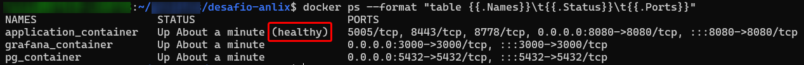
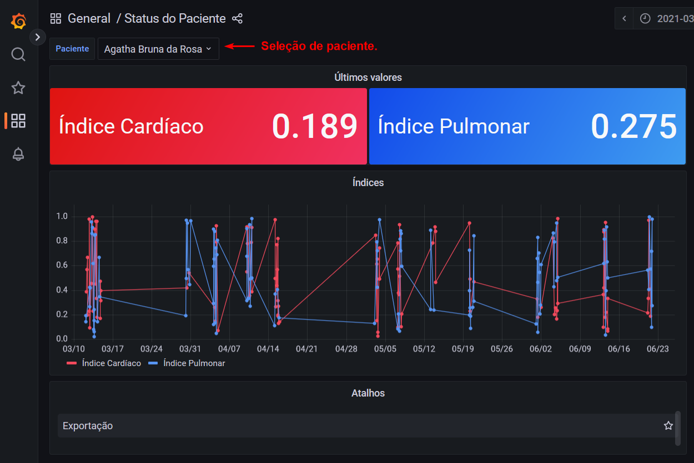
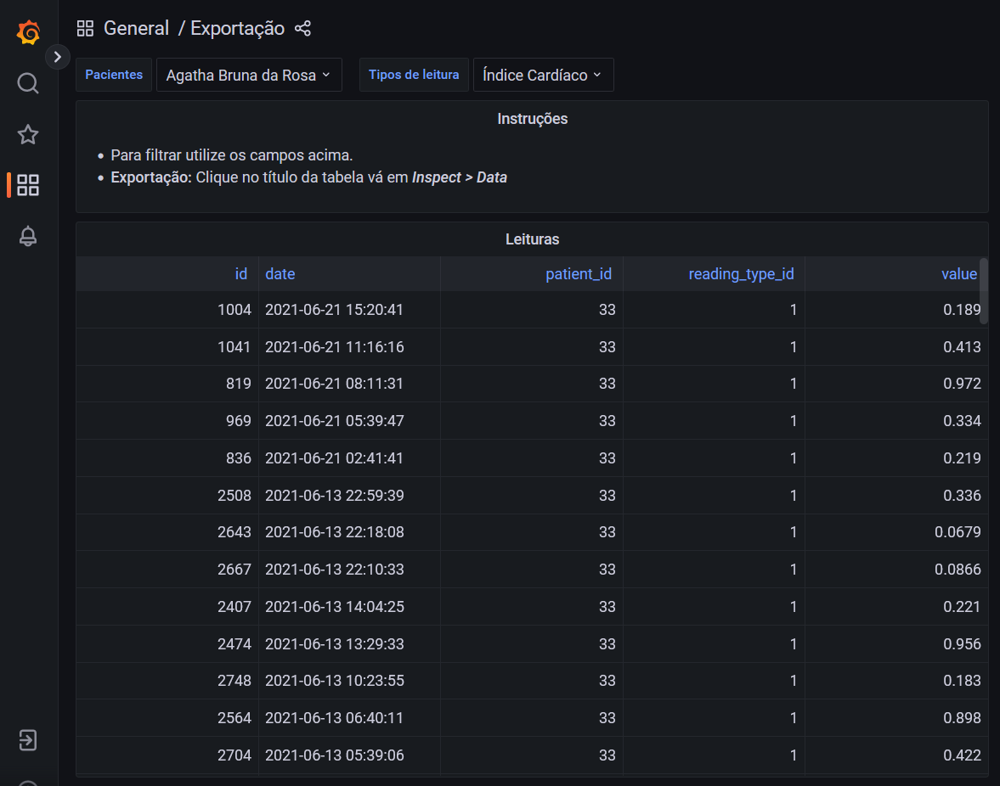
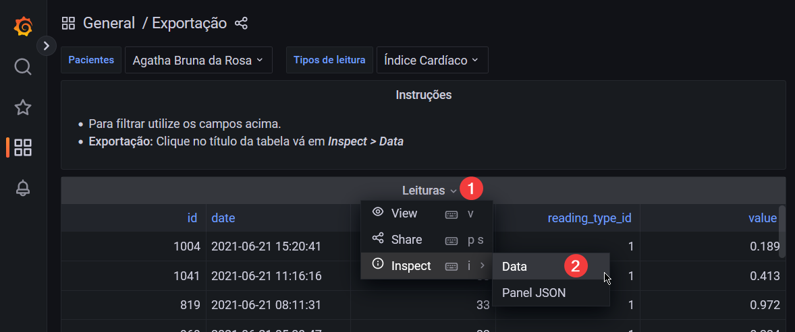
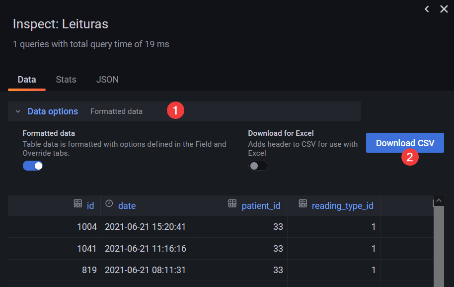

# Desafio Anlix

  - [Sobre o desafio](#sobre-o-desafio)
    - [Rest API](#rest-api)
    - [Dashboard](#dashboard)
  - [Utilização](#utilização)
    - [Executar aplicação](#executar-aplicação)
    - [Rest API](#rest-api-1)
    - [Dashboards](#dashboards)

## Sobre o desafio

### Rest API
Os arquivos texto localizados no diretório dados apresentam diversas características sobre pacientes terminais internados em um hospital, que  são fornecidos por áreas distintas e sempre serão fornecidos separadamente. Os arquivos texto fornecidos por uma mesma área estão nomeados com datas distintas, pois retratam características dos pacientes em diferentes dias. Precisamos que você crie um software que contenha uma base de dados consultável através de uma **API REST** capaz de:

* [X] Consultar, para cada paciente, cada uma das características individualmente e cada uma delas sendo a mais 
  recente disponível;

  > /reading/latest?patient={patient_id}&reading-type={reading_type_id}

* [X] Consultar em uma única chamada, todas as características de um paciente, com os valores mais recentes de cada uma;

  > /patient/{id}/status

* [X] Consultar para uma determinada data (dia, mês e ano), todas as características existentes de todos os pacientes da base de dados;

  > /reading?date={date}

* [X] Consultar uma característica qualquer de um paciente para um intervalo de datas a ser especificado na chamada 
  da API;

  > /reading?patient={patient_id}&from-date={date}&to-date={date}

* [X] Consultar o valor mais recente de uma característica de um paciente que esteja entre um intervalo de valores a 
  ser especificado na chamada da API;

  > /reading?patient={patient_id}&reading-type={reading_type_id}&from-date={value}&to-date={value}

* [X] Consultar pacientes que contenham um nome ou parte de um nome a ser especificado na chamada da API.

  > /patient/find?name={string}

### Dashboard

Além disso, precisamos que algumas informações estejam disponíveis em uma interface web. É importante ressaltar que o diretor do hospital necessita exibir essa interface para todos os investidores da instituição e também para o corpo de médicos. Os requisitos são os seguintes:

* [X] Buscar um paciente por nome e exibir o valor mais recente de cada uma de suas características;
* [X] Exibir um gráfico temporal para um determinado paciente e uma determinada característica a ser inserida 
  através da interface;
* [X] Ser possível exportar as características de um ou mais pacientes de todas as datas disponíveis para um arquivo 
  CSV.


## Utilização

### Executar aplicação
Execute todos recursos usados pela aplicação com o comando:

```shell
docker compose up -d
```

A aplicação backend leva alguns segundos para ficar disponível, seu status pode ser verificado pela listagem de 
containers e será apresentado como _**healthy**_ quando estiver pronta para utilização.

```shell
docker ps --format "table {{.Names}}\t{{.Status}}\t{{.Ports}}"
```



### Rest API

Teste os endpoints da API pelo swagger ou postman.

> **_Swagger:_**  http://localhost:8080/q/swagger
> 
> **_OpenAPI:_**  http://localhost:8080/q/openapi

### Dashboards

O dashboard com as informações do paciente e exportação estará disponível no endereço:

> **_Grafana:_**  http://localhost:3000/

Na página inicial são apresentados os status do paciente, destacando a última leitura para cada tipo de índice e um 
gráfico histórico para todos os índices.

Na parte superior é possível filtrar por paciente e ao clicar na legenda do gráfico mostrasse apenas o índice 
selecionado.



O atalho no dashboard do paciente leva à tela de exportação de dados, os filtros na parte superior permitem 
selecionar vários pacientes e vários tipos de leitura.

Na tabela são mostrados todos os dados histórico com base nos filtros de paciente e tipo de leitura.



Para exportar os dados, clique no título da tabela (1), vá na opção **_Inspect_** e então clique em **_Data_** (2).



Será aberto o painel de inspeção, em **_Data options_** configure a exportação conforme sua necessidade (1) e então 
clique no botão 
**_Download CSV_** (2).

